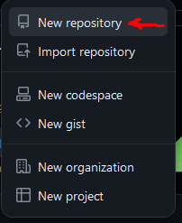
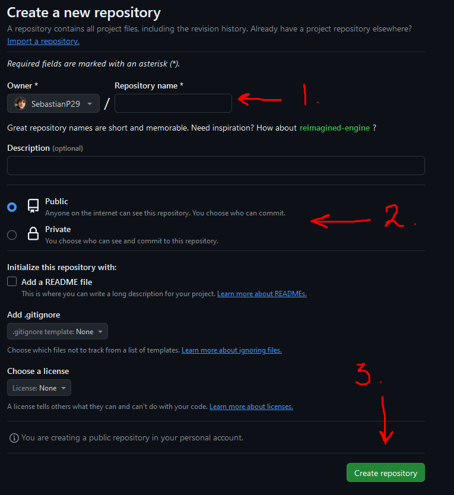

# Práctica 8

## ¿Cómo se inicializa un repositorio en _Git_?
Para inicializar un repositorio en _Git_:
1. Se abre la terminal de _Git Bash_.
1. Se introduce el siguiente comando.
```bash
git init
```

## ¿Cómo creas un repositorio en _GitHub_?
Para crear un repositorio en _Github_:
1. Nos dirigimos a la página principal de _GitHub_.

2.  En la esquina superior derecha, localizamos el siguiente botón y desplegamos la lista:


3. Hacemos _click_ en "Nuevo Repositorio".



4. Nombramos a nuestro repositorio, decidimos si queremos que sea público o privado, y por último hacemos _click_ al botón verde que dice "Crear Repositorio".



## ¿Cómo vinculas un repositorio local de _Git_ con uno remoto en _GitHub_?
Para vincular un repositorio de _Git_ con uno de _GitHub_:
1. Se abre la terminal de _Git Bash_.
1. Se introduce la siguiente línea de comandos donde:
```bash
git remote add origin https://github.com/nombreusuario/nombrerepositorio.git

git push -u origin main
```
El enlace de la primera línea es el enlace del repositorio en _GitHub_ al que se desea vincular.

## ¿Cuál es el flujo básico de trabajo en _Git_ y _GitHub_?
Existen tres estados locales que se almacenan de manera local que se trabajan en _Git_, y un estado remoto que se trabaja en alguna plataforma, en éste caso _GitHub_.

Estos 4 estados se conocen de la siguiente manera:

- _modified_: le corresponde el _Working Directory_. Es la carpeta de la computadora donde se trabaja en un proyecto.

- _staged_: le corresponde la _Staging Area_. Es en donde _Git_ guarda los cambios hechos al proyecto que se está trabajando antes de su registro.

- _commited_: le corresponde el _Local Repository_. Es en donde los cambios ya se guardaron en el registro e indica en qué cambio va el repositorio.

- _remote_: le corresponde el _Remote Repository_. Ya es el directorio remoto donde se almacena el proyecto en alguna plataforma _web_ como _GitHub_.

## ¿Para qué sirve el archivo _.gitignore_? 
Sirve para tener archivos en el repositorio local sin que se muestren en el repositorio remoto.

## ¿Cuál es el propósito de una rama?
Es para trabajar en una versión paralela a la principal, que después se puede fusionar a ésta. Es útil a la hora de trabajar en diferentes funcionalidades de un proyecto y cuando se trabaja en equipo.

## ¿Qué es una fusión?
La unión de dos ramas.

## Explica los diferentes tipos de fusión que existen.
Existen dos tipos de fusión:
- _Fast-Forward_: se da cuando no hay conflictos, resolviéndose de manera automática.
- _Manual Merge_: se da cuando hay conflictos, e implica resolverse de manera manual.

## ¿Cómo puedes ver el historial de tu repositorio?
Utilizando el siguiente comando en la terminal:
```bash
git log
```

## ¿Cuál es el propósito de una etiqueta?
Versionar el proyecto que se está trabajando.